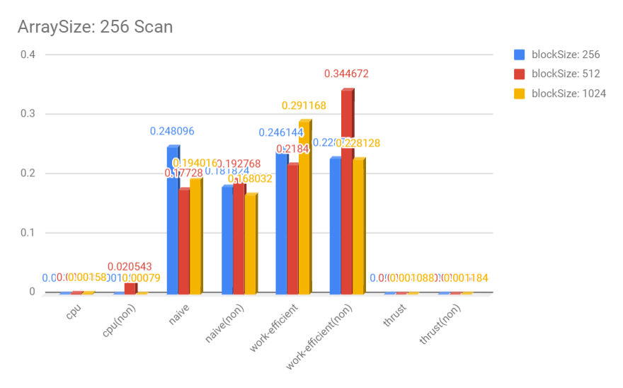
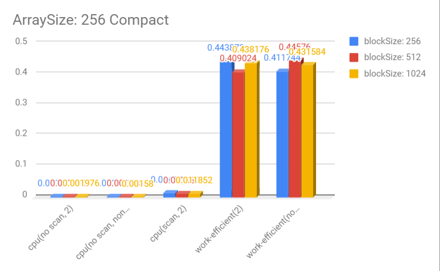
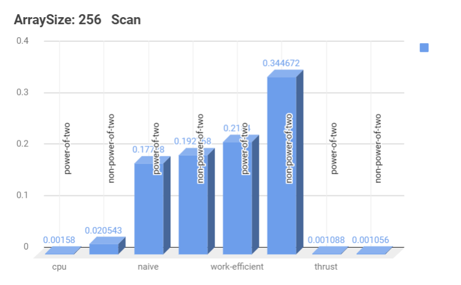
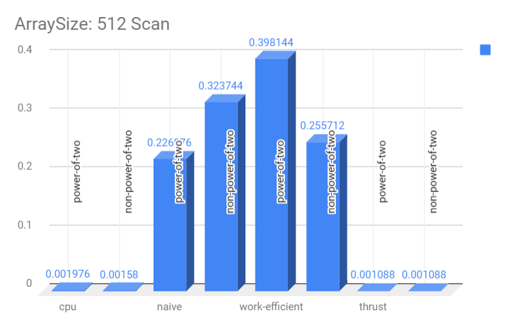
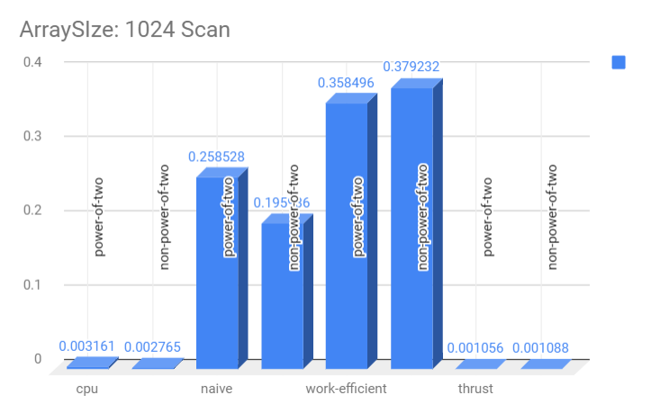
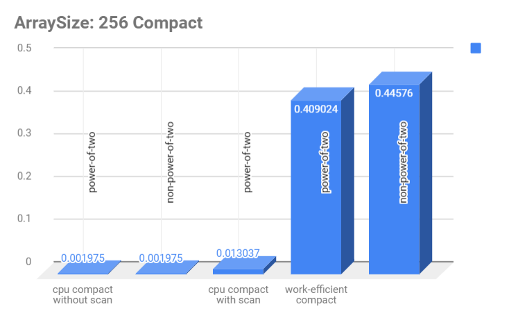
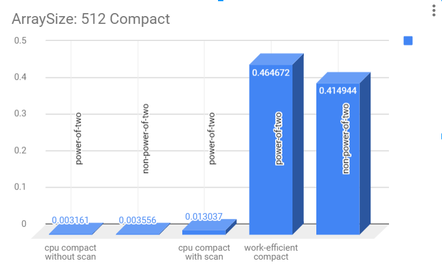
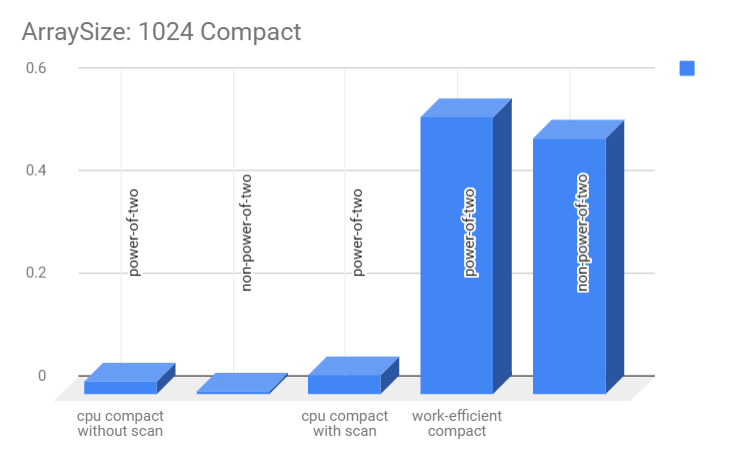

CUDA Stream Compaction
======================

**University of Pennsylvania, CIS 565: GPU Programming and Architecture, Project 2**

* Xinyu Lin
[Linkedin](https://www.linkedin.com/in/xinyu-lin-138352125/)
* Tested on: Windows 10, Intel64 Family 6 Model 94 Stepping 3 GenuineIntel ~2600 Mhz, 16GB, GTX960M(Private Computer)

### Features

* CPU Scan & Stream Compaction
* Naive GPU Scan Algorithm
* Work-Efficient GPU Scan
* Work-Efficient GPU Stream Compaction
* Thrust Implementation

### Performance Analysis
* BlockSize over Scan methods(ArraySize: 256)

* BlockSize over Compact methods(ArraySize: 256)

* ArraySize over Scan methods(BlockSize: 512)

* ArraySize over Compact methods(BlockSize: 512)

